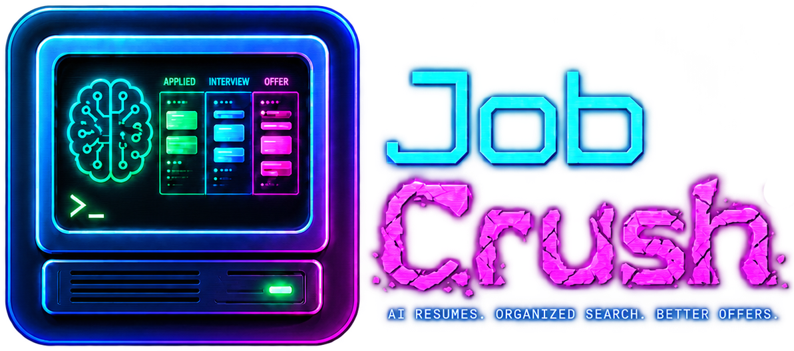

<p align="center">
  
</p>

<p align="center">
  <a href="https://github.com/ultramanjones/jobcrush/actions/workflows/build.yml"></a>
</p>

<p align="center"><b>Organize. Personalize. Get Hired.</b></p>

Job Crush is a desktop command center for the job search, built with **Qt Quick / C++**. Every application lives on a kanban pipeline, every document is prepared and staged before you ever open a job portal, and an interchangeable **AIBrain** helps you parse postings, judge fit, and draft cover letters — while you make every call that matters.

## Why this exists

One night mid-job-search, a task that should have taken fifteen minutes took three hours — and right when the application was finally ready, the portal went into scheduled maintenance before the resume could be submitted.

Job Crush is built so that never happens again. Everything is prepared, reviewed, and staged **first**; the portal visit becomes the short, mechanical last step instead of the whole evening.

## How it thinks

- **Staged, not automated.** The AI drafts; a human reviews and sends. Nothing leaves the app on its own.
- **Bring your own brain.** The AIBrain interface takes interchangeable providers — Anthropic, OpenAI, or a local model — with your own API key. The tracker is fully useful with no key at all.
- **Hand-built front end.** Pure Qt Quick. The components are written, not generated, and the QML is meant to be read.

## Status

Early and moving. Built in public, used daily by its author on a live job search.

- [x] Phase 1 — application skeleton, dark shell, CI (Windows + Linux)
- [ ] Phase 2 — data core: SQLite persistence, application models
- [ ] Phase 3 — pipeline board (kanban) and job detail pane
- [ ] Phase 4 — AIBrain provider plumbing
- [ ] Phase 5 — staged application packets
- [ ] Phase 6 — statistics dashboard and polish

## Building

Requires Qt 6.5+ and CMake 3.21+.

```
cmake -S . -B build -DCMAKE_BUILD_TYPE=Release
cmake --build build
```

Or open `CMakeLists.txt` in Qt Creator and hit Run.

## License

MIT — see [LICENSE](LICENSE).
